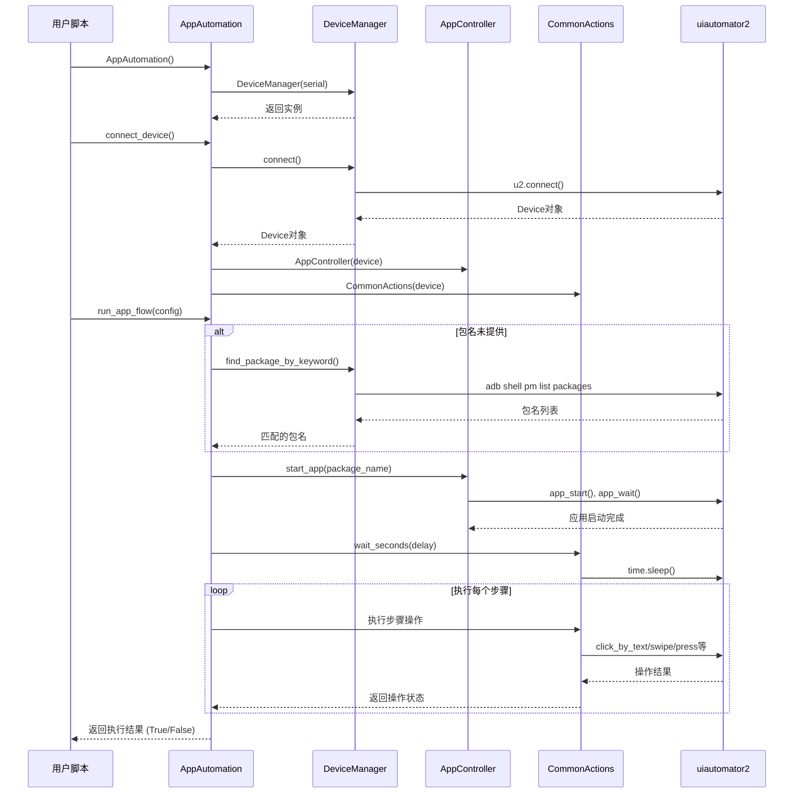

# Android 应用自动化框架

一个基于 uiautomator2 的通用 Android 应用自动化框架，支持支付宝签到、微信操作、汽水音乐自动化等场景。

## 目录

- [项目概述](#项目概述)
- [功能特性](#功能特性)
- [架构设计](#架构设计)
- [模块说明](#模块说明)
- [完整流程图](#完整流程图)
- [使用示例](#使用示例)
- [环境要求](#环境要求)
- [安装指南](#安装指南)
- [扩展开发](#扩展开发)

## 项目概述

本项目是一个通用的 Android 应用自动化测试/操作框架，基于 uiautomator2 库开发。它提供了一套简洁易用的 API，可以方便地实现 Android 设备的自动化操作，如应用启动、UI 交互、页面导航等。

### 核心设计理念

1. **模块化设计**：将设备管理、应用控制、通用操作分离，职责清晰
2. **配置驱动**：通过 AppConfig 类定义自动化流程，无需修改核心代码
3. **容错机制**：每个操作都有多重备选方案，提高鲁棒性
4. **可扩展性**：支持添加新的应用配置和自定义操作步骤

## 功能特性

### 已实现功能

- **设备连接管理**：支持 USB 和无线 ADB 连接
- **应用包名查找**：通过关键字模糊匹配应用包名
- **应用生命周期管理**：启动、停止应用
- **丰富的 UI 操作**：
  - 多种元素定位方式（文本、描述、ID、坐标）
  - 文本输入（支持清空和追加）
  - 屏幕滑动（上下左右）
  - 系统按键模拟（返回、主页、最近应用）
  - 截图功能
- **内置应用配置**：
  - 支付宝每日签到
  - 微信基础操作（示例）
  - 汽水音乐自动化

### 技术栈

- **Python 3.7+**：核心开发语言
- **uiautomator2**：Android UI 自动化库
- **ADB (Android Debug Bridge)**：设备通信基础

## 架构设计

### 整体架构图

```
┌─────────────────────────────────────────────────────────────────────────────┐
│                              用户脚本/应用层                                    │
│  (create_alipay_config, create_wechat_config, create_qishui_music_config)   │
└─────────────────────────────────────────────────────────────────────────────┘
                                        │
                                        ▼
┌─────────────────────────────────────────────────────────────────────────────┐
│                           AppAutomation (核心协调层)                            │
│  ┌─────────────┐  ┌───────────────┐  ┌─────────────────┐                     │
│  │AppController│  │CommonActions  │  │  DeviceManager  │                     │
│  │  应用控制    │  │   UI操作      │  │   设备管理       │                     │
│  └─────────────┘  └───────────────┘  └─────────────────┘                     │
└─────────────────────────────────────────────────────────────────────────────┘
                                        │
                                        ▼
┌─────────────────────────────────────────────────────────────────────────────┐
│                        uiautomator2 + ADB (底层依赖层)                         │
│  ┌─────────────┐  ┌───────────────┐  ┌─────────────────┐                     │
│  │ uiautomator2│  │    ADB        │  │  Android Device │                     │
│  │   库        │  │  命令行工具    │  │   Android 设备   │                     │
│  └─────────────┘  └───────────────┘  └─────────────────┘                     │
└─────────────────────────────────────────────────────────────────────────────┘
```

### 架构层次说明

| 层级 | 组件 | 职责 |
|------|------|------|
| **用户脚本层** | create_*_config 函数 | 定义具体的自动化流程和步骤 |
| **核心协调层** | AppAutomation | 协调各组件，执行自动化流程 |
| **操作封装层** | AppController, CommonActions, DeviceManager | 封装具体操作，提供简洁接口 |
| **底层依赖层** | uiautomator2, ADB, Android Device | 提供底层设备访问能力 |

## 模块说明

### 1. app_automation.py（核心模块）

#### 主要类和函数

**AppConfig 数据类**

应用配置类，用于定义自动化流程的基本信息。

```python
@dataclass
class AppConfig:
    name: str                    # 应用显示名称
    package_keyword: str         # 包名关键字（用于自动查找）
    package_name: Optional[str]  # 完整包名（可选）
    launch_timeout: float        # 启动超时时间
    post_launch_delay: float     # 启动后等待时间
    steps: List[Callable]        # 自动化步骤列表
```

**AppAutomation 类**

自动化流程管理器，是整个框架的核心。

| 方法 | 功能 |
|------|------|
| `__init__(device_serial)` | 初始化，可指定设备序列号 |
| `connect_device()` | 连接设备并初始化控制器 |
| `find_app_package(keyword)` | 通过关键字查找单个应用包名 |
| `find_all_app_packages(keyword)` | 通过关键字查找所有匹配的包名 |
| `launch_app(package_name, wait, timeout)` | 启动应用 |
| `stop_app(package_name)` | 停止应用 |
| `run_app_flow(app_config)` | 执行完整的自动化流程 |

**内置配置函数**

| 函数 | 功能 |
|------|------|
| `create_alipay_config()` | 创建支付宝签到配置 |
| `create_wechat_config()` | 创建微信操作配置（示例） |
| `create_qishui_music_config()` | 创建汽水音乐自动化配置 |

### 2. device_manager.py（设备管理模块）

**DeviceManager 类**

负责设备连接和应用包名管理。

| 方法 | 功能 |
|------|------|
| `__init__(serial)` | 初始化，可指定设备序列号 |
| `connect()` | 连接设备，返回 u2.Device 对象 |
| `get_installed_packages()` | 获取所有已安装应用包名 |
| `find_package_by_keyword(keyword)` | 查找第一个匹配的包名 |
| `find_packages_by_keyword(keyword)` | 查找所有匹配的包名 |

### 3. app_controller.py（应用控制模块）

**AppController 类**

封装应用的启动和停止操作。

| 方法 | 功能 |
|------|------|
| `__init__(device)` | 初始化，接收 u2.Device 对象 |
| `start_app(package_name, wait, timeout)` | 启动应用，支持等待 |
| `stop_app(package_name)` | 停止应用 |

### 4. common_actions.py（通用操作模块）

**CommonActions 类**

封装常见的 UI 操作，是最高频使用的模块。

#### 点击操作

| 方法 | 功能 |
|------|------|
| `click_if_exists(timeout, **selector)` | 通用安全点击方法 |
| `click_by_text(text, timeout)` | 通过文本点击 |
| `click_by_description(description, timeout)` | 通过 content-description 点击 |
| `click_by_resource_id(resource_id, timeout)` | 通过 resource-id 点击 |
| `click_by_coordinates(x, y)` | 通过坐标点击（支持相对/绝对） |

#### 文本输入

| 方法 | 功能 |
|------|------|
| `input_text(text, clear, **selector)` | 向元素输入文本 |

#### 等待操作

| 方法 | 功能 |
|------|------|
| `wait_seconds(seconds)` | 固定等待指定秒数 |
| `wait_for_element(timeout, **selector)` | 等待元素出现 |
| `wait_for_element_gone(timeout, **selector)` | 等待元素消失 |

#### 系统按键

| 方法 | 功能 |
|------|------|
| `press_back()` | 模拟返回键 |
| `press_home()` | 模拟主页键 |
| `press_recent()` | 模拟最近应用键 |

#### 滑动操作

| 方法 | 功能 |
|------|------|
| `swipe(start_x, start_y, end_x, end_y, duration)` | 通用滑动方法 |
| `swipe_up(duration)` | 向上滑动 |
| `swipe_down(duration)` | 向下滑动 |
| `swipe_left(duration)` | 向左滑动 |
| `swipe_right(duration)` | 向右滑动 |

#### 其他操作

| 方法 | 功能 |
|------|------|
| `screenshot(filename)` | 截图并保存 |
| `get_screen_size()` | 获取屏幕尺寸（宽, 高） |

## 完整流程图

### 1. 主执行流程图

```mermaid
flowchart TD
    A[开始] --> B[创建 AppAutomation 实例]
    B --> C{是否指定设备序列号?}
    C -->|是| D[使用指定序列号初始化 DeviceManager]
    C -->|否| E[使用默认设备初始化 DeviceManager]
    D --> F[调用 connect_device() 连接设备]
    E --> F
    F --> G[创建 AppConfig 配置对象]
    G --> H[调用 run_app_flow() 执行流程]
    H --> I{设备是否已连接?}
    I -->|否| J[自动连接设备]
    I -->|是| K{是否已提供包名?}
    J --> K
    K -->|否| L[通过关键字查找包名]
    L --> M{是否找到包名?}
    M -->|否| N[输出错误信息]
    N --> O[返回 False]
    M -->|是| P[启动应用]
    K -->|是| P
    P --> Q[等待应用加载]
    Q --> R[开始执行自动化步骤]
    R --> S[循环执行每个步骤]
    S --> T{步骤执行成功?}
    T -->|否| U[输出步骤错误信息]
    U --> O
    T -->|是| V{还有更多步骤?}
    V -->|是| S
    V -->|否| W[输出流程完成信息]
    W --> X[返回 True]
    X --> Y[结束]
    O --> Y
```

### 2. 支付宝签到详细流程图

```mermaid
flowchart TD
    A[开始支付宝签到流程] --> B[启动支付宝应用]
    B --> C[等待 5 秒（应用加载）]
    C --> D[步骤1: 点击'我的'标签]
    D --> E{通过文本点击'我的'?}
    E -->|否| F{通过 description 点击'我的'?}
    F -->|否| G[通过坐标点击右下角 (0.85, 0.95)]
    E -->|是| H[步骤2: 点击'支付宝会员']
    F -->|是| H
    G --> H
    H --> I{通过文本点击'支付宝会员'?}
    I -->|否| J{通过 description 点击?}
    J -->|否| K[通过坐标点击中上 (0.5, 0.3)]
    I -->|是| L[步骤3: 等待 7 秒（页面加载）]
    J -->|是| L
    K --> L
    L --> M[步骤4: 点击'每日签到']
    M --> N{通过文本点击'每日签到'?}
    N -->|否| O{通过 description 点击?}
    O -->|否| P[通过坐标点击 (0.5, 0.4)]
    N -->|是| Q[步骤5: 等待 15 秒（签到完成）]
    O -->|是| Q
    P --> Q
    Q --> R[步骤6: 返回主页]
    R --> S[按下 HOME 键]
    S --> T[签到流程完成]
    T --> U[结束]
```

### 3. 模块交互时序图



## 使用示例

### 基本使用示例

```python
from app_automation import AppAutomation, create_alipay_config

# 1. 创建自动化实例
automation = AppAutomation()

# 2. 连接设备
print("正在连接设备...")
device = automation.connect_device()
print(f"设备连接成功: {device}")

# 3. 查看已安装的应用（可选）
packages = automation.device_manager.get_installed_packages()
print(f"设备上已安装 {len(packages)} 个应用")

# 4. 执行支付宝签到流程
print("\n开始执行支付宝签到流程...")
alipay_config = create_alipay_config()
success = automation.run_app_flow(alipay_config)

if success:
    print("\n✅ 支付宝签到流程执行成功！")
else:
    print("\n❌ 支付宝签到流程执行失败！")
```

### 多应用执行示例

```python
from app_automation import (
    AppAutomation,
    create_alipay_config,
    create_wechat_config,
    create_qishui_music_config
)

# 创建自动化实例并连接设备
automation = AppAutomation()
automation.connect_device()

# 定义要执行的任务列表
tasks = [
    ("支付宝签到", create_alipay_config()),
    ("微信操作", create_wechat_config()),
    ("汽水音乐", create_qishui_music_config()),
]

# 依次执行每个任务
for task_name, config in tasks:
    print(f"\n{'='*50}")
    print(f"开始执行: {task_name}")
    print(f"{'='*50}")
    
    success = automation.run_app_flow(config)
    
    if success:
        print(f"✅ {task_name} 执行成功")
    else:
        print(f"❌ {task_name} 执行失败")
```

### 自定义自动化流程示例

```python
from app_automation import AppAutomation, AppConfig

def create_my_app_config():
    """创建自定义应用配置"""
    
    def step1_click_button(automation):
        """第一步：点击按钮"""
        if automation.common_actions:
            print("点击开始按钮...")
            # 优先通过文本点击
            if not automation.common_actions.click_by_text("开始"):
                # 备选：通过坐标点击
                automation.common_actions.click_by_coordinates(0.5, 0.5)
    
    def step2_wait_and_scroll(automation):
        """第二步：等待并滑动"""
        if automation.common_actions:
            print("等待页面加载...")
            automation.common_actions.wait_seconds(3)
            
            print("向下滑动查看更多内容...")
            automation.common_actions.swipe_down()
            automation.common_actions.wait_seconds(1)
    
    def step3_go_back(automation):
        """第三步：返回"""
        if automation.common_actions:
            print("返回上一页...")
            automation.common_actions.press_back()
            automation.common_actions.wait_seconds(2)
            
            print("返回主页...")
            automation.common_actions.press_home()
    
    return AppConfig(
        name="我的应用",
        package_keyword="com.example.myapp",
        package_name=None,  # 自动查找
        launch_timeout=15.0,
        post_launch_delay=8.0,
        steps=[
            step1_click_button,
            step2_wait_and_scroll,
            step3_go_back
        ]
    )

# 使用自定义配置
automation = AppAutomation()
automation.connect_device()

my_config = create_my_app_config()
automation.run_app_flow(my_config)
```

## 环境要求

### 硬件要求

- **Android 设备**：手机或平板
  - Android 版本：4.4 (API 19) 及以上
  - 已开启 USB 调试模式
  - 已授权电脑连接
- **电脑**：Windows/Mac/Linux
  - 已安装 Python 3.7+
  - 已安装 ADB 工具

### 软件要求

| 软件 | 版本要求 | 说明 |
|------|----------|------|
| Python | 3.7+ | 核心运行环境 |
| uiautomator2 | 最新版 | Android UI 自动化库 |
| ADB | 最新版 | Android 调试桥 |
| pip | 最新版 | Python 包管理器 |

### 设备设置

1. **开启开发者选项**
   - 设置 → 关于手机 → 连续点击"版本号"7次
   
2. **开启 USB 调试**
   - 设置 → 开发者选项 → USB 调试 → 开启
   
3. **开启 USB 安装（可选）**
   - 设置 → 开发者选项 → USB 安装 → 开启（用于安装应用）
   
4. **授权电脑连接**
   - 首次连接时，设备会弹出授权对话框，点击"允许"

## 安装指南

### 1. 安装 Python

确保已安装 Python 3.7 或更高版本：

```bash
python --version
# 或
python3 --version
```

### 2. 安装 ADB

**方式一：通过 Android Studio（推荐）**
1. 下载并安装 [Android Studio](https://developer.android.com/studio)
2. 安装完成后，ADB 工具位于：
   - Windows: `C:\Users\<用户名>\AppData\Local\Android\Sdk\platform-tools\`
   - Mac: `~/Library/Android/sdk/platform-tools/`
   - Linux: `~/Android/Sdk/platform-tools/`
3. 将该路径添加到系统环境变量 PATH 中

**方式二：单独安装 ADB**
- 下载 [SDK Platform Tools](https://developer.android.com/studio/releases/platform-tools)
- 解压并添加到 PATH

**验证安装：**
```bash
adb version
```

### 3. 安装 Python 依赖

```bash
# 安装 uiautomator2
pip install uiautomator2

# 或使用国内镜像
pip install uiautomator2 -i https://pypi.tuna.tsinghua.edu.cn/simple
```

### 4. 初始化设备（首次使用）

连接设备后，需要初始化 uiautomator2：

```bash
# 初始化设备（会在设备上安装 atx-agent）
python -m uiautomator2 init
```

### 5. 验证安装

```bash
# 1. 连接设备（USB 连接）
adb devices

# 2. 测试 uiautomator2 连接
python -c "import uiautomator2 as u2; d = u2.connect(); print(d.info)"
```

如果输出设备信息，说明安装成功。

### 常见问题

**Q1: ADB 找不到设备**
- 检查 USB 线是否正常
- 检查设备是否开启 USB 调试
- 检查是否授权电脑连接
- 尝试重新插拔 USB 线

**Q2: uiautomator2 连接失败**
- 确保已执行 `python -m uiautomator2 init`
- 检查设备网络连接（无线调试时）
- 尝试重启设备和电脑

**Q3: 点击操作无效**
- 检查元素文本是否正确（区分大小写）
- 尝试使用坐标点击作为备选
- 增加等待时间，确保页面加载完成

## 扩展开发

### 添加新的应用配置

要添加新的应用自动化配置，只需按照以下模式创建新的配置函数：

```python
def create_my_app_config() -> AppConfig:
    """创建我的应用配置"""
    
    def step1(automation: AppAutomation) -> None:
        """步骤1：描述"""
        if automation.common_actions:
            # 执行操作
            pass
    
    def step2(automation: AppAutomation) -> None:
        """步骤2：描述"""
        if automation.common_actions:
            # 执行操作
            pass
    
    return AppConfig(
        name="应用名称",
        package_keyword="包名关键字",
        package_name=None,  # 或指定完整包名
        launch_timeout=10.0,
        post_launch_delay=5.0,
        steps=[step1, step2]  # 按顺序排列步骤
    )
```

### 自定义操作步骤

每个步骤都是一个接收 `AppAutomation` 实例的函数，可以通过 `automation.common_actions` 访问所有 UI 操作：

```python
def custom_step(automation: AppAutomation) -> None:
    """自定义步骤示例"""
    if not automation.common_actions:
        return  # 安全检查
    
    ca = automation.common_actions
    
    # 1. 等待元素出现
    ca.wait_for_element(timeout=10, text="确认")
    
    # 2. 点击按钮
    ca.click_by_text("确认")
    
    # 3. 等待处理
    ca.wait_seconds(2)
    
    # 4. 截图记录
    ca.screenshot("after_confirm.png")
    
    # 5. 返回
    ca.press_back()
```

### 最佳实践建议

1. **使用多重点击策略**
   ```python
   # 推荐：优先文本，备选描述，最后坐标
   if not ca.click_by_text("按钮"):
       if not ca.click_by_description("按钮"):
           ca.click_by_coordinates(0.5, 0.5)
   ```

2. **合理使用等待**
   ```python
   # 优先使用条件等待
   ca.wait_for_element(timeout=10, text="下一步")
   
   # 仅在必要时使用固定等待
   ca.wait_seconds(3)
   ```

3. **添加详细日志**
   ```python
   print("正在执行步骤 X...")
   # 执行操作
   print("步骤 X 执行完成")
   ```

4. **异常处理**
   ```python
   try:
       # 可能失败的操作
       ca.click_by_text("可能不存在的按钮")
   except Exception as e:
       print(f"操作失败: {e}")
       # 备选方案
       ca.click_by_coordinates(0.5, 0.5)
   ```

## 项目文件结构

```
zhifubao_checkin/
├── app_automation.py      # 核心自动化模块（主入口）
├── app_controller.py      # 应用控制模块
├── common_actions.py      # 通用 UI 操作模块
├── device_manager.py      # 设备管理模块
└── README.md              # 项目说明文档（本文档）
```

## 许可证

本项目仅供学习和研究使用，请遵守相关法律法规和应用服务条款。

---

## 更新日志

### v1.0.0 (2026-05-02)
- 初始版本发布
- 实现核心自动化框架
- 添加支付宝签到配置
- 添加微信操作示例配置
- 添加汽水音乐自动化配置
- 完善代码注释和文档
